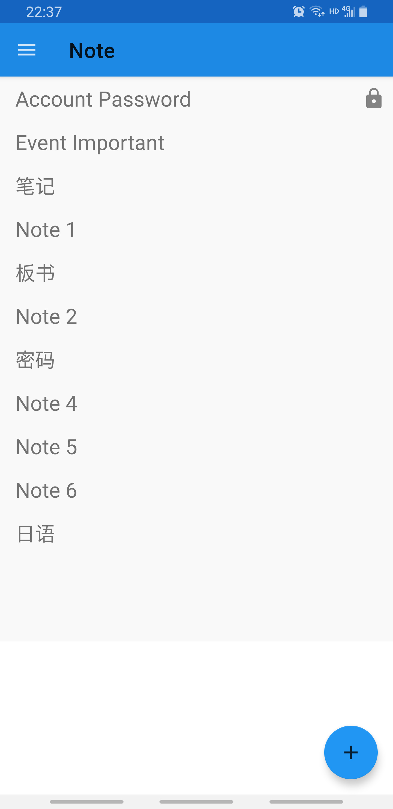
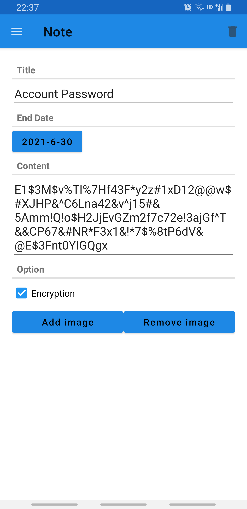
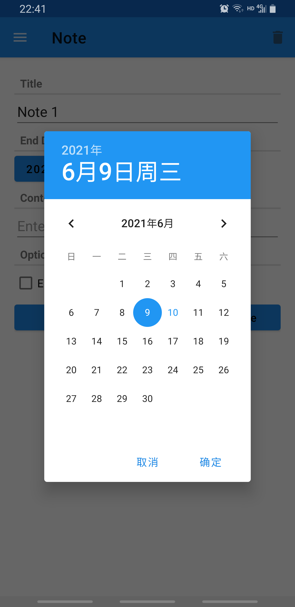
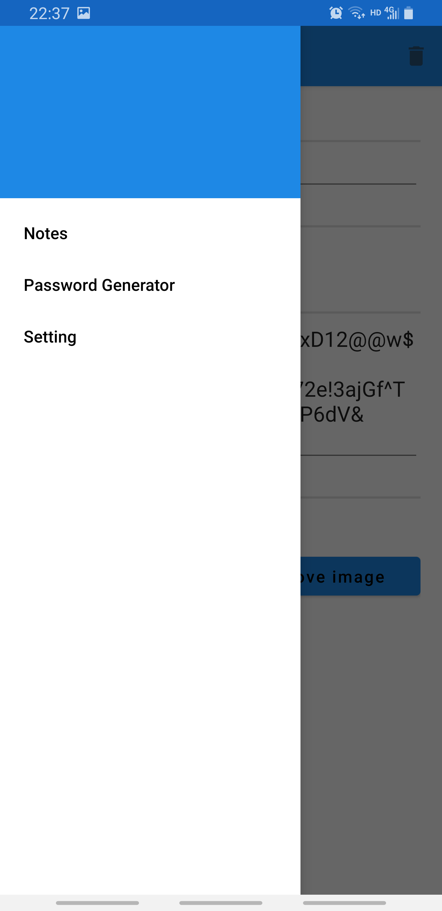
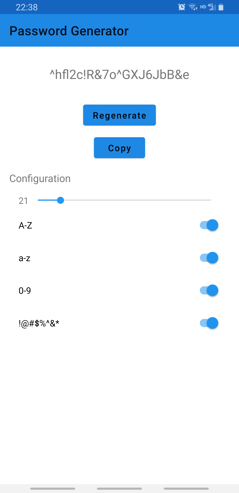
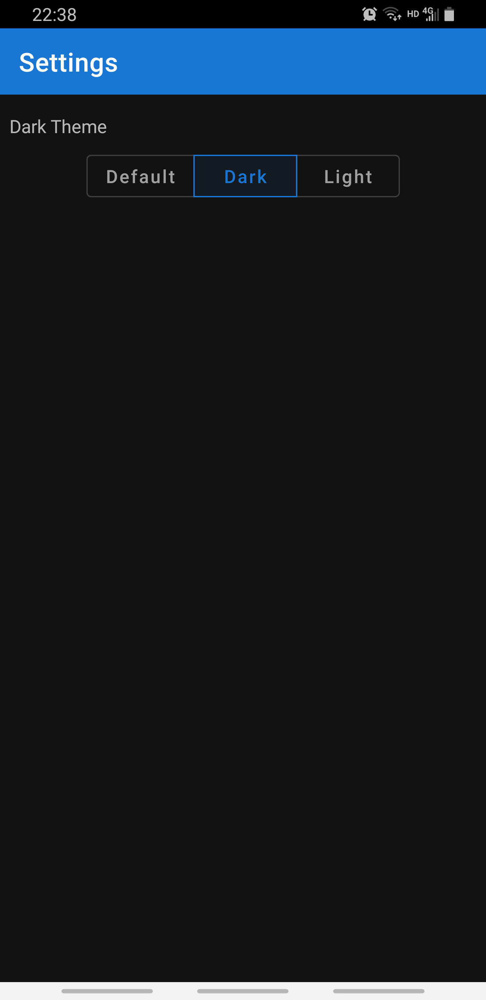

# EnNote

> The notebook that allows encryption and many conveniences.

## Features

- Material UI

- Notes
  - Date
  - Encryption (Biometrics)
  - Image
- Password Generator
- Dark Theme

---

## Interface

- Note List

- Note

- Date

- Menu

- Password Generator

- Dark Theme

---

## Device Requirement

- Android 9 (API 28)
- 20MB storage
- Biometrics device preferred
